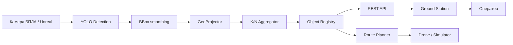

<p align="center">
  
</p>

<h1 align="center">SkySight</h1>

<p align="center">
  UAV-based real-time fire, smoke and human detection system with a ground control station, route planning and Unreal Engine simulation.
</p>

<p align="center">
  <a href="https://github.com/darkkpax/SkySight/actions"></a>
  
  
  
  
</p>

---

## что это за проект

**SkySight** — программный комплекс для мониторинга лесных и труднодоступных территорий с помощью БПЛА. Система получает видеопоток с дрона или симулятора, выполняет нейросетевую детекцию пожара, дыма и людей, переводит найденные объекты в координаты карты, подтверждает события через агрегацию и показывает результат оператору в наземной станции.

Проект собран как полноценная связка из нескольких частей:

| часть | назначение |
|---|---|
| **ground station** | интерфейс оператора на PySide6 / Qt Quick: карта, видеопоток, маршруты, маркеры, журнал событий |
| **onboard module** | бортовой модуль: камера, YOLO-инференс, сглаживание bbox, геопроекция, агрегация, передача событий |
| **route planner** | построение маршрутов обследования, lawn-mower покрытие, TSP, облёт подтверждённых целей |
| **Unreal simulator** | симулятор БПЛА, камеры, пожара, дыма и мира на Unreal Engine 5 |
| **REST API** | обмен между модулями, приём детекций, статус системы, Prometheus-метрики |
| **native core** | опциональные C++/pybind11 ускорения для тяжёлых расчётов |

---

## основные возможности

- обнаружение **пожара**, **дыма** и **людей** на кадрах с камеры БПЛА;
- работа с YOLO-моделью через Ultralytics, с настройкой confidence, IoU и классов;
- перевод bbox из координат изображения в географические координаты с учётом параметров камеры и телеметрии;
- фильтрация ложных тревог через K/N voting, трекинг и дедупликацию объектов;
- построение маршрутов обследования территории и автоматический облёт целей;
- наземная станция с интерактивной картой, видеопотоком, телеметрией и журналом;
- поддержка нескольких источников БПЛА: Unreal, stub, MAVLink и внешний SDK;
- локальный запуск без Unreal через стаб `scripts/unreal_bridge_stub.py`;
- развёртывание на x86_64, ARM, Jetson и Rockchip через Docker/systemd;
- REST API и метрики для интеграции с внешними сервисами.

---

## как это работает



1. БПЛА или симулятор отдаёт видеопоток и телеметрию.
2. Бортовой модуль запускает YOLO-инференс и получает bbox объектов.
3. Система сглаживает детекции, считает географическое положение цели и проверяет устойчивость события.
4. Подтверждённые объекты попадают в реестр, отображаются на карте и могут влиять на маршрут.
5. Оператор видит карту, видео, события и может подтвердить действия или изменить сценарий полёта.

Подробнее: [`docs/HOW_IT_WORKS.md`](docs/HOW_IT_WORKS.md)

---

## скриншоты и материалы

> скриншоты интерфейса лучше хранить в `docs/screenshots/`, чтобы README сразу выглядел как презентационная страница проекта.

| экран | что показать |
|---|---|
| `docs/screenshots/ground-station.png` | главное окно оператора: карта, видео, маркеры, телеметрия |
| `docs/screenshots/detection-overlay.png` | кадр с bbox пожара/дыма/человека |
| `docs/screenshots/unreal-simulator.png` | сцена Unreal Engine с дроном, лесом, дымом и огнём |
| `docs/screenshots/route-planner.png` | построенный маршрут обследования и точки облёта |

```md


```

---

## быстрый старт

### требования

- Python 3.10+;
- Poetry или pip;
- Windows / Linux для GUI с Qt WebEngine;
- CUDA-совместимая видеокарта желательно, но CPU-режим тоже поддерживается;
- Unreal Engine 5.x, если нужен полноценный симулятор.

### установка через скрипт

```powershell
# Windows
powershell -ExecutionPolicy Bypass -File scripts/setup_env.ps1
```

```bash
# Linux / macOS
bash scripts/setup_env.sh
```

### установка вручную

```bash
# только бортовой модуль
pip install -e ".[module,detect]"

# наземная станция + модуль + детекция + dev-инструменты
pip install -e ".[ground,module,detect,dev]"
```

---

## запуск

### наземная станция оператора

```bash
poetry run python -m fire_uav.main
```

по умолчанию запускается роль `ground`: карта, видеопоток, маркеры объектов, маршруты и панель управления.

### бортовой модуль

```bash
# Windows PowerShell
$env:FIRE_UAV_ROLE = "module"
poetry run python -m fire_uav.main
```

```bash
# Linux / macOS
FIRE_UAV_ROLE=module poetry run python -m fire_uav.main
```

### REST API

```bash
poetry run uvicorn fire_uav.api.main_rest:app --host 0.0.0.0 --port 8000
```

основные эндпоинты:

| метод | путь | назначение |
|---|---|---|
| `POST` | `/api/detections` | принять батч детекций с телеметрией |
| `POST` | `/api/camera/start` | запустить камеру |
| `GET` | `/api/status` | получить состояние системы |
| `GET` | `/plan` | получить текущий маршрут |
| `GET` | `/metrics` | Prometheus-метрики |

если задан `FIRE_UAV_API_TOKEN`, API требует `X-API-Key` или `Authorization: Bearer`.

подробнее: [`docs/GETTING_STARTED.md`](docs/GETTING_STARTED.md)

---

## Unreal Engine симулятор

исходники симулятора находятся в `unrealbridge/`:

```text
unrealbridge/
├── SkySight.uproject
├── SkySight.sln
├── Source/
└── native_core/
```

симулятор поднимает HTTP-интерфейс, через который Python получает телеметрию, видео и отправляет команды дрону:

| endpoint | назначение |
|---|---|
| `GET /sim/v1/telemetry` | координаты, ориентация, заряд, состояние БПЛА |
| `GET /sim/v1/video.ts` | H.264 видеопоток камеры |
| `POST /sim/v1/route` | загрузить маршрут |
| `POST /sim/v1/command` | отправить команду: hold, resume, rtl, orbit и т.д. |

если Unreal не нужен, можно поднять совместимый стаб:

```bash
UNREAL_BRIDGE_PORT=9000 python scripts/unreal_bridge_stub.py
```

подробнее: [`docs/UNREAL_ENGINE.md`](docs/UNREAL_ENGINE.md)

---

## модель детекции

по умолчанию проект ожидает модель:

```text
data/models/best_yolo11.pt
```

ключевые параметры лежат в `fire_uav/config/settings_default.json`:

```json
{
  "yolo_model": "data/models/best_yolo11.pt",
  "yolo_conf": 0.15,
  "yolo_iou": 0.45,
  "yolo_classes": [0, 1]
}
```

модель загружается через Ultralytics YOLO, устройство выбирается автоматически: `cuda`, если доступна видеокарта, иначе `cpu`.

подробнее: [`docs/MODEL.md`](docs/MODEL.md)

---

## подключение нового БПЛА

в конфиге предусмотрены разные backend-режимы:

| `uav_backend` | когда использовать |
|---|---|
| `unreal` | симулятор Unreal Engine |
| `stub` | локальная разработка без реального дрона |
| `mavlink` | реальный дрон через MAVLink |
| `custom` | внешний SDK через integration service |

минимально новый БПЛА должен отдавать:

- видеопоток или кадры камеры;
- телеметрию: координаты, высота, курс, крен, тангаж, заряд;
- приём маршрута или команд управления;
- единый идентификатор БПЛА и камеры.

подробнее: [`docs/ADD_NEW_UAV.md`](docs/ADD_NEW_UAV.md)

---

## развёртывание

для Jetson:

```bash
docker buildx build --platform linux/arm64 \
  --build-arg BASE_IMAGE=nvcr.io/nvidia/l4t-pytorch:r35.4.1-pth2.3-py3 \
  --build-arg INSTALL_TORCH=0 \
  -t fire-uav:jetson .
```

для CPU/ARM64:

```bash
docker buildx build --platform linux/arm64 -t fire-uav:arm64 .
```

запуск:

```bash
docker run --rm --network host \
  -e FIRE_UAV_ROLE=module \
  -e FIRE_UAV_PROFILE=jetson \
  fire-uav:jetson
```

подробнее: [`docs/DEPLOYMENT.md`](docs/DEPLOYMENT.md) и [`docs/DEPLOYMENT_ARM.md`](docs/DEPLOYMENT_ARM.md)

---

## структура проекта

```text
fire_uav/
├── api/                    # FastAPI REST endpoints
├── config/                 # настройки и профили
├── core/                   # общие схемы и helper-логика
├── ground_app/             # вход в наземную станцию
├── gui/                    # PySide6 / Qt Quick интерфейс
├── module_app/             # вход в бортовой модуль
├── module_core/            # детекция, маршруты, геометрия
├── services/               # EventBus, хранилища, адаптеры
└── utils/

unrealbridge/               # Unreal Engine 5 симулятор
cpp/native_core/            # C++ pybind11 ускорения
integration_service/        # интеграция внешних SDK
scripts/                    # setup, env_check, unreal stub
docs/                       # документация проекта
tests/                      # pytest тесты
```

---

## документация

| документ | для кого | что внутри |
|---|---|---|
| [`docs/GETTING_STARTED.md`](docs/GETTING_STARTED.md) | разработчик | установка, запуск, переменные окружения, проверка окружения |
| [`docs/HOW_IT_WORKS.md`](docs/HOW_IT_WORKS.md) | разработчик / защита проекта | архитектура, поток данных, логика компонентов |
| [`docs/UNREAL_ENGINE.md`](docs/UNREAL_ENGINE.md) | разработчик UE | запуск симулятора, API, видео, телеметрия, команды |
| [`docs/MODEL.md`](docs/MODEL.md) | ML-разработчик | модель, классы, пороги, замена весов, экспорт |
| [`docs/ADD_NEW_UAV.md`](docs/ADD_NEW_UAV.md) | интегратор | MAVLink/custom backend, требования к телеметрии и камере |
| [`docs/DEPLOYMENT.md`](docs/DEPLOYMENT.md) | devops / инженер | Docker, systemd, Jetson, ARM, токены, профили |
| [`docs/OPERATOR_GUIDE.md`](docs/OPERATOR_GUIDE.md) | оператор | порядок работы, контроль тревог, маршруты, действия при событии |
| [`docs/API.md`](docs/API.md) | backend / интеграция | REST API, форматы запросов и ответов |

---

## разработка

```bash
pytest
pytest --cov=fire_uav --cov-report=term-missing
ruff check fire_uav/
ruff check fire_uav/ --fix
```

полезные команды:

```bash
make install
make test
make lint
make fmt
make run-ground
make run-module-unreal
make run-bridge
```

---

## статус проекта

SkySight сейчас выглядит как исследовательско-инженерный проект, который уже имеет основу для демонстрации полного сценария: симулятор, наземная станция, детекция, API, маршрутизация и варианты развёртывания. Для коммерческого уровня дальше важно добавить реальные скриншоты, демо-видео, стабильный release pipeline, набор обученных моделей и полноценные полевые тесты.
