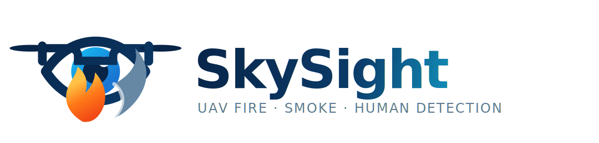

  

<h1 align="center">SkySight</h1>

  система мониторинга с БПЛА для обнаружения пожара, дыма и людей в реальном времени

  
  
  
  

---

## О ПРОЕКТЕ

**SkySight** — приложение для мониторинга территории с помощью БПЛА. Проект объединяет наземную станцию оператора, бортовой модуль детекции, планирование маршрута и симулятор на Unreal Engine 5.

Система получает видеопоток с камеры дрона или симулятора, запускает нейросетевую детекцию, сопоставляет найденные объекты с координатами на карте и отображает результат в интерфейсе оператора.

## ВОЗМОЖНОСТИ

- детекция пожара, дыма и людей на кадрах с БПЛА;
- отображение маршрута, телеметрии и найденных объектов на карте;
- наземная станция на PySide6 / Qt Quick;
- интеграция с Unreal Engine 5 симулятором;
- поддержка локального stub-режима для разработки без симулятора;
- подготовка к подключению реального БПЛА через MAVLink или внешний SDK;
- REST API для обмена детекциями, статусом и маршрутами;
- Docker/systemd-развёртывание для edge-устройств и серверов.

## КОМПОНЕНТЫ

| компонент | описание |
|---|---|
| **Ground Station** | интерфейс оператора с картой, видеопотоком, телеметрией и журналом |
| **Onboard Module** | модуль обработки кадров, детекции и передачи событий |
| **Detection Pipeline** | YOLO-инференс, сглаживание bbox, агрегация и реестр объектов |
| **Route Planner** | построение маршрута обследования и облёта целей |
| **Unreal Bridge** | HTTP-мост между Python-частью и симулятором Unreal Engine |
| **REST API** | интеграция компонентов и внешних сервисов |

## ДОКУМЕНТАЦИЯ

| файл | описание |
|---|---|
| [`GETTING_STARTED.md`](GETTING_STARTED.md) | установка и запуск проекта |
| [`HOW_IT_WORKS.md`](HOW_IT_WORKS.md) | архитектура и поток данных |
| [`UNREAL_ENGINE.md`](UNREAL_ENGINE.md) | симулятор Unreal Engine |
| [`MODEL.md`](MODEL.md) | модель детекции и замена весов |
| [`ADD_NEW_UAV.md`](ADD_NEW_UAV.md) | подключение нового БПЛА |
| [`DEPLOYMENT.md`](DEPLOYMENT.md) | развёртывание проекта |
| [`OPERATOR_GUIDE.md`](OPERATOR_GUIDE.md) | инструкция для оператора |
| [`API.md`](API.md) | REST API и интеграции |
| [`LICENSE`](LICENSE) | лицензия проекта |
