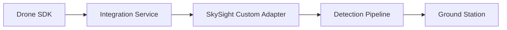

# подключение нового БПЛА

этот документ описывает, как подключить к SkySight новый источник телеметрии, камеры и команд управления.

## доступные backend-режимы

| backend | назначение |
|---|---|
| `unreal` | симулятор Unreal Engine |
| `stub` | локальная разработка без реального БПЛА |
| `mavlink` | реальный БПЛА через MAVLink |
| `custom` | внешний SDK через integration service |

настройка находится в `fire_uav/config/settings_default.json`:

```json
{
  "uav_backend": "unreal",
  "mavlink_connection_string": "udp:127.0.0.1:14550",
  "custom_sdk_config": {}
}
```

## минимальный контракт БПЛА

новый БПЛА или адаптер должен закрывать четыре направления:

1. **телеметрия** — координаты, высота, yaw/pitch/roll, скорость, заряд;
2. **камера** — кадры или видеопоток;
3. **маршруты** — загрузка списка точек;
4. **команды** — hold, resume, rtl, orbit, set speed.

## телеметрия

рекомендуемый состав телеметрии:

| поле | описание |
|---|---|
| `lat` | широта |
| `lon` | долгота |
| `alt_m` | высота в метрах |
| `yaw_deg` | курс |
| `pitch_deg` | тангаж |
| `roll_deg` | крен |
| `speed_mps` | скорость |
| `battery_percent` | заряд аккумулятора |
| `timestamp` | время измерения |

## камера

камера должна отдавать кадры с достаточной частотой и стабильным размером изображения. Для корректной геопроекции важно указать:

- FOV;
- направление установки камеры;
- pitch/yaw/roll камеры относительно корпуса;
- разрешение кадра;
- частоту кадров.

## MAVLink

для MAVLink-сценария обычно нужно:

```json
{
  "uav_backend": "mavlink",
  "mavlink_connection_string": "udp:127.0.0.1:14550"
}
```

типовые строки подключения:

```text
udp:127.0.0.1:14550
tcp:192.168.1.10:5760
serial:/dev/ttyUSB0:57600
```

## custom backend

если у дрона есть свой SDK, проще подключить его через внешний сервис. В этом случае SDK работает отдельно, а SkySight получает унифицированные данные через `integration_service` или HTTP/gRPC-прослойку.

пример идеи:



## чек-лист интеграции

- БПЛА отдаёт координаты и ориентацию;
- камера выдаёт стабильные кадры;
- FOV камеры указан корректно;
- маршруты принимаются и выполняются;
- команды hold/resume/rtl работают;
- время телеметрии синхронизировано;
- детекции корректно отображаются на карте;
- при потере связи система показывает ошибку, а не зависает.

## что тестировать первым

1. получение телеметрии без видео;
2. получение видео без детекции;
3. детекция на отдельных кадрах;
4. геопроекция bbox в карту;
5. загрузка маршрута;
6. ручные команды;
7. полный сценарий обнаружения и облёта цели.
