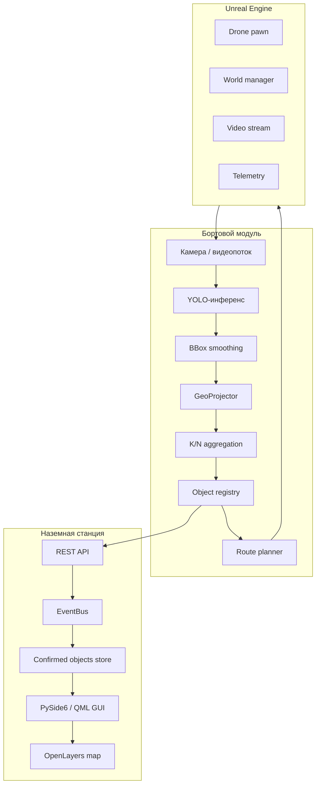

# как работает SkySight

SkySight состоит из наземной станции, бортового модуля, симулятора Unreal Engine и вспомогательных сервисов. Основной сценарий: камера БПЛА передаёт кадры, модель находит опасные объекты, система переводит их в координаты карты, подтверждает событие и показывает оператору.

## общая схема

## режимы запуска

единственная точка входа — `python -m fire_uav.main`. Роль выбирается через переменную `FIRE_UAV_ROLE` или поле `role` в `fire_uav/config/settings_default.json`.

| роль | назначение |
|---|---|
| `ground` | графическая наземная станция оператора |
| `module` | бортовой headless-модуль с детекцией, телеметрией и маршрутизацией |

## бортовой модуль

бортовой модуль отвечает за обработку данных около источника видео. В реальном сценарии он может работать на Jetson, мини-ПК или другом вычислителе, связанном с дроном.

основные задачи:

- получение кадров с камеры;
- запуск YOLO-модели;
- фильтрация классов;
- сглаживание bbox между кадрами;
- пересчёт координат bbox в географическое положение;
- подтверждение целей через агрегацию;
- передача результата в наземную станцию;
- корректировка маршрута при появлении цели.

точка входа: `fire_uav/module_app/main_module.py`.

## наземная станция

наземная станция нужна оператору. Она показывает карту, телеметрию, видеопоток, найденные объекты и события системы.

типовая логика интерфейса:

1. оператор выбирает район обследования;
2. система строит маршрут;
3. БПЛА выполняет полёт;
4. найденные объекты появляются на карте;
5. оператор подтверждает тревогу или продолжает наблюдение;
6. при необходимости дрон уходит на облёт цели или возвращается на маршрут.

точка входа: `fire_uav/ground_app/main_ground.py`. Интерфейс находится в `fire_uav/gui/qml/`, связка Python ↔ QML — в `fire_uav/gui/viewmodels/`.

## детекция и агрегация

одиночная детекция на кадре не считается окончательным событием. Для снижения ложных срабатываний используется несколько уровней проверки:

| уровень | назначение |
|---|---|
| confidence threshold | отсекает слабые предсказания модели |
| IoU threshold | управляет NMS и пересечениями bbox |
| bbox smoothing | уменьшает дрожание рамок |
| K/N voting | подтверждает цель только после нужного числа попаданий в окне кадров |
| geo deduplication | объединяет близкие цели в одну запись |
| suppression TTL | временно подавляет повторные тревоги в той же зоне |

## геопроекция

геопроекция нужна, чтобы из bbox на изображении получить примерную точку на карте. Для расчёта используются:

- ширина и высота кадра;
- параметры камеры;
- FOV;
- высота полёта;
- pitch, roll, yaw;
- координаты БПЛА;
- направление камеры.

если доступен native core, часть расчётов может быть перенесена в C++.

## маршруты

маршрутизатор строит маршрут обследования и может добавлять манёвры вокруг подтверждённых целей.

поддерживаемые идеи:

- grid / lawn-mower маршрут для покрытия площади;
- TSP-оптимизация порядка точек;
- ограничения по батарее и запасу на возвращение;
- no-fly зоны через GeoJSON;
- orbit-маршруты вокруг одной или нескольких целей.

## интеграции

| интеграция | назначение |
|---|---|
| `unreal` | HTTP-мост к Unreal Engine симулятору |
| `stub` | локальная имитация телеметрии и видео для разработки |
| `mavlink` | подключение реального БПЛА через MAVLink |
| `custom` | внешний SDK через `integration_service` |

## Unreal Engine

Unreal Engine используется как управляемый симулятор. Он отдаёт телеметрию и видео, а Python-часть может отправлять команды и маршруты. Это позволяет тестировать систему без реального БПЛА и безопасно отлаживать сценарии пожара, дыма и поиска людей.
